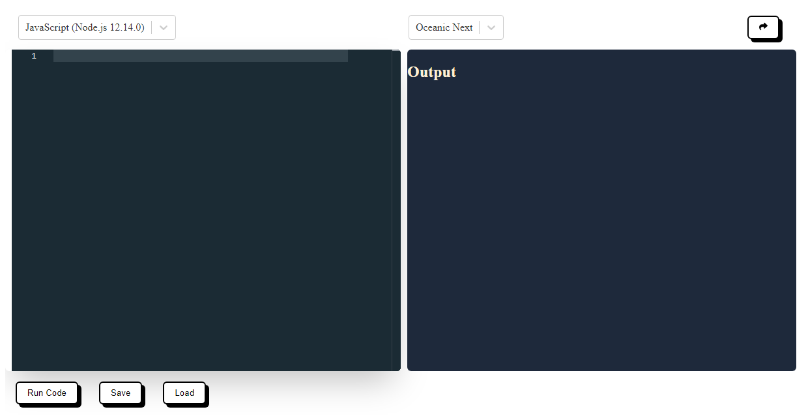

<!-- PROJECT LOGO -->
 

  

  <h3 align="center">Code Editor</h3>

  <!-- TABLE OF CONTENTS -->

  
Table of Contents

  <ol>
    <li>
      <a href="#about-the-project">About The Project</a>
      <ul>
        <li><a href="#built-with">Built With</a></li>
      </ul>
    </li>
    <li><a href="#to-do">TO-DO</a></li>
    <li><a href="#acknowledgments">Acknowledgments</a></li>
  </ol>

<!-- ABOUT THE PROJECT -->
## About The Project

[![Code Editor][icodeOnline.png]](https://example.com)

Here's an online code editor that enables you to compile and execute your code using JudgeO api, you also get to save and share your code by copying the url link or sending your code via email.

(<a href="#readme-top">back to top</a>)

### Built With

* [![React][React.js]][React-url]
* [![Sass][Sass]][sass-url]

(<a href="#readme-top">back to top</a>)

### To-Do
* User Authentication: Add user authentication to allow users to have their own accounts and save their code privately.
* Version Control: Integrate with version control systems (e.g., Git) to enable users to commit and manage their code changes directly from the editor.

<!-- ACKNOWLEDGMENTS -->
## Acknowledgments

* [Freecodecamp article](https://www.freecodecamp.org/news/how-to-build-react-based-code-editor/)

(<a href="#readme-top">back to top</a>)

